# The Whole Enchilada

<p align="center">
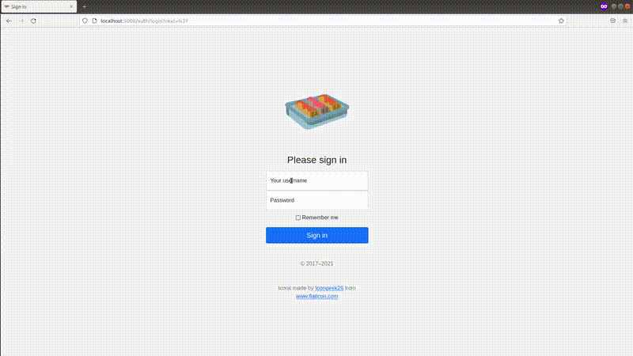
</p>

## Overview

The Whole Enchilada (TWE) is a demonstration project utilizing a variety of technologies to train and deploy machine learning algorithms:

  - **Containerization:**
    - Containerization using Docker
    - Container orchestration using Docker Compose
    - Allows web app, database, and visualization containers to communicate
    - No need for user to worry about installing dependencies
  - **Web App Container:**
    - Built from the official Python Docker image
    - Web server powered by `Flask` and `Waitress`
    - Web app constructed from Jinja templates and styled using Bootstrap
  - **Database Container:**
    - Oracle's official MySQL Docker image
    - MySQL server stores machine learning datasets
    - Responds to queries for machine learning data from web app
    - Used by `Flask-Login` to authenticate web app users
  - **Visualizations Container:**
    - Built from the official Python Docker image
    - Visualizations produced by a `Bokeh` server for EDA and evaluation of model performance
    - Serves visualizations for datasets selected by user in web app
    - `Bokeh` widgets allow user to select ML models and tune hyperparameters
    - Regression and classification powered by `scikit-learn`

[Docker](https://docs.docker.com/get-docker/) and [Docker Compose](https://docs.docker.com/compose/install/) are required to run TWE.  See the following section for instructions on setting up Docker secrets and building the Docker images.

## Table of Contents

* [The Whole Enchilada](#the-whole-enchilada)
   * [Overview](#overview)
   * [Table of Contents](#table-of-contents)
   * [Running The Whole Enchilada](#running-the-whole-enchilada)
   * [Docker and Docker Compose](#docker-and-docker-compose)
      * [Passing Credentials and Sensitive Information using Docker Secrets](#passing-credentials-and-sensitive-information-using-docker-secrets)
   * [Flask](#flask)
      * [Datasets](#datasets)
         * [Selecting and loading a dataset](#selecting-and-loading-a-dataset)
         * [Exploratory Data Analysis (EDA)](#exploratory-data-analysis-eda)
            * [Summary Tab](#summary-tab)
            * [Feature Importance Tab](#feature-importance-tab)
            * [Crossfilter Tab](#crossfilter-tab)
            * [Grid Plot Tab](#grid-plot-tab)
      * [Train](#train)
      * [Results](#results)
      * [Running tests in development mode](#running-tests-in-development-mode)
         * [Embedding the test reports](#embedding-the-test-reports)
   * [MySQL](#mysql)
      * [TWE's use of the MySQL server](#twes-use-of-the-mysql-server)
      * [MySQL Default Authentication Method](#mysql-default-authentication-method)
   * [Bokeh](#bokeh)
      * [Setting up a Bokeh server](#setting-up-a-bokeh-server)
      * [Securing access to the Bokeh server](#securing-access-to-the-bokeh-server)
      * [Checking if the Bokeh plot has rendered](#checking-if-the-bokeh-plot-has-rendered)
      * [Limitations of the Bokeh server](#limitations-of-the-bokeh-server)
      * [Bokeh versus Seaborn](#bokeh-versus-seaborn)
   * [References and Acknowledgments](#references-and-acknowledgments)
   * [Appendix A: Useful Commands](#appendix-a-useful-commands)
      * [General Docker commands](#general-docker-commands)
      * [Docker commands for MySQL container](#docker-commands-for-mysql-container)


## Running The Whole Enchilada

Once Docker and Docker Compose are installed, clone this repo and navigate to the `docker/secrets/` directory.  Follow the instructions contained in the example files to create secret keys and passwords.  Refer to the [Docker secrets section below](#passing-credentials-and-sensitive-information-using-docker-secrets) for more details.

Run the following command inside the cloned directory to build the TWE images and spin-up all three containers:

```bash
$ docker-compose up
```

You can add the optional `-d` argument at the end of the command to "detach" or run without needing a terminal open.  However, the MySQL database takes some time to initialize the first time that the container is launched, and so I recommend running Docker Compose attached to the terminal so that you receive a notification when the database is ready.  Once the containers are launched and initialized, navigate to `http://localhost:5000/` to access the web app and log in with your MySQL username and password.  The MySQL username is defined in `docker-compose.yaml` and is set to "flask" by default.  If you wish to change this default do so *before* building the images.

The above command will run TWE in production mode.  If you'd like to run TWE in development mode use the following command:

```bash
$ docker-compose -f docker-compose.yml -f docker/docker-compose.dev.yml up -d
```

## Docker and Docker Compose

TWE is comprised of three containers spun-up from three Docker images that communicate with each other over a single Docker network.  One of the images is Oracle's [official MySQL Docker image](https://hub.docker.com/_/mysql) and is used without modification.  The other two images use the [official Python Docker image](https://hub.docker.com/_/python) as a base image, and run a `Flask` web app and a `Bokeh` server, respectively.

The two Python images are designed using [multi-stage Docker files](https://docs.docker.com/develop/develop-images/multistage-build/) that break the Dockerfile into base, development, and production stages.  The base stage includes operations that are common to both the development and production stages.  The latter stages build on top of this base stage with stage-specific operations.  This removes the need to have multiple Dockerfiles, reduces image size, and reduces build time when creating the image.  I was careful to follow Docker's [best practices guide](https://docs.docker.com/develop/develop-images/dockerfile_best-practices/) when creating the Dockerfiles to leverage the build cache as much as possible.  In general, this means organizing the order of operations in the Dockerfile from least-frequently changed to most-frequently changed, and only copying files to the image that are absolutely necessary for the build.  This approach minimizes the number of layers that will be invalidated when a copied file or a Dockerfile operation change.

The major differences between development mode and production mode are as follows:

- **Development mode:**
  - Runs `Flask` in development mode which restarts the web server on changes to source code
  - Runs `Bokeh` server in development mode which restarts the server on changes to source code
    - Only works on one Bokeh app at a time!  See [limitations section](#limitations-of-the-bokeh-server) for details.
  - Allows the user to run unit tests and integration tests from within the Flask web app

- **Production mode:**
  - Runs web app using the `Waitress` production WSGI web server
  - Runs all three `Bokeh` apps (EDA, train, results) without development mode
  - Removes the option to run unit tests and integration tests from the web app


### Passing Credentials and Sensitive Information using Docker Secrets

Sensitive information such as the MySQL passwords and the secret keys for the `Flask` and `Bokeh` servers should not be hard-coded in plain text in either the Python code or the Docker Compose YAML file.  A common approach in non-Docker contexts is to create a file (typically named `.env`) containing the sensitive information and use [python-dotenv](https://pypi.org/project/python-dotenv/) to load the sensitive data into environment variables.  So long as this `.env` file is not committed to source control or copied to the Docker image it would appear to be a secure method to pass sensitive data to the Docker containers.

The problem with the environment variable approach is that the sensitive information stored in the environment could be viewed by an end user.  This is a potential security risk, and so Docker recommends the so-called "Docker secrets" approach to handling sensitive information that needs to be passed to Docker containers.

Docker secrets encrypts passwords or other sensitive information and only makes it available to services that have been granted explicit access to it.  The key here is that the secrets are only available to *services*, not standalone containers.  This approach will thus only work with Docker Compose and Docker Swarm.  The official documentation for Docker secrets has an [example using Docker Compose](https://docs.docker.com/engine/swarm/secrets/#use-secrets-in-compose) for a MySQL database - exactly my use-case!  The MySQL environment variables in the YAML file can be set to named secret variables, which in turn point to unencrypted files that store the passwords in plain text on the local machine.  The contents of these local files are encrypted and stored in the Docker image at build time.  When a container is created from the image, the contents of the secret files are decrypted and stored in `/run/secrets/` in the memory of the container.  The decrypted information is then accessible by code run inside the container.

The documentation does not provide any information as to the formatting of these files, or whether multiple passwords could be stored in a single file.  I assume that each file can only contain one password.

The final configuration requires four separate files:
- **bokeh_secret_key.txt** to supply a secret key to both the `Bokeh` and `Flask` servers
- **db_root_password.txt** to supply the secret root password to the MySQL and `Flask` servers
- **db_user_password.txt** to supply the secret user password to the MySQL server
- **web_secret_key.txt** to supply a secret key to the `Flask` webserver for generating CSRF tokens

I've included examples of these files (suffixed with '_example') in this repository for reference.  They are meant to be copied and renamed to the filenames above and filled out with the desired passwords or keys.  All secret files are added to both `.gitignore` and `.dockerignore` so that the sensitive information that they contain does not end up in the Git repository or the Docker image, respectively.


## Flask
The `Flask` web app is the control center through which the user accesses all of the functionality of The Whole Enchilada project.  I designed the web app using [Bootstrap](https://getbootstrap.com/docs/5.0/getting-started/introduction/) example pages that I customized and converted into Jinja templates.  Bootstrap takes care of a lot of the headaches of web design like cross-browser compatibility, responsive sizing, and general styling and layout.  Bootstrap allows the developer to deliver an attractive, modern web app with a minimal amount of effort on web design.

Upon navigating to `localhost:5000/` the user is prompted to login with the username specified in the Docker Compose YAML file and the password supplied as a Docker secret.  The login credentials are checked against the MySQL server using `Flask-Login`.  This is discussed in more detail in the [MySQL section](#mysql).

<p align="center">
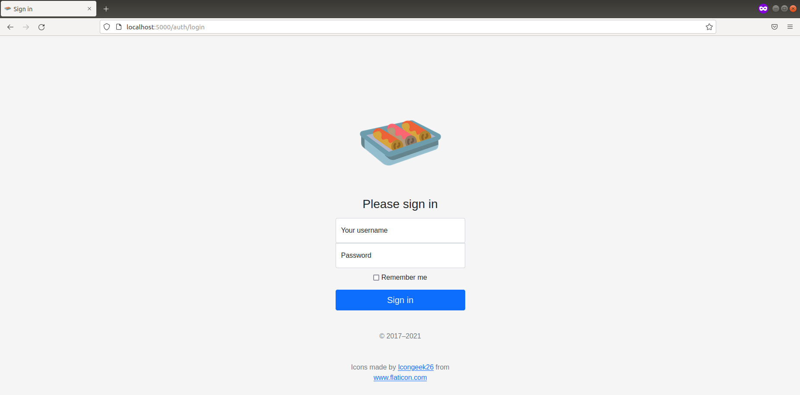
</p>

The web app has three main functional areas:
1. The **Datasets** section, where a dataset is chosen and exploratory data analysis is performed.
2. The **Train** section, where a machine learning model is selected, hyperparameters are tuned, and the model is trained on the data.
3. The **Results** section, where detailed information on the model's performance is presented.

<p align="center">
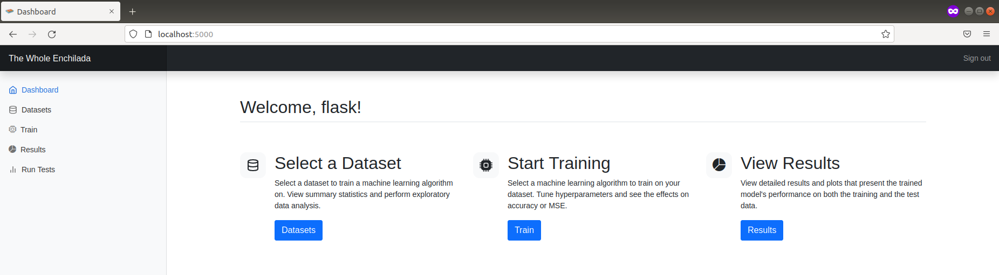
</p>

### Datasets
The datasets section allows the user to load datasets into the MySQL database, and then select a dataset of interest to perform exploratory data analysis (EDA) on.

#### Selecting and loading a dataset
Upon navigating to the datasets page, the user is informed that they should select a dataset from the dropdown menu in the top-right, and if no datasets exist they can load them into the MySQL database on the "Load Datasets" page (shown below).

<p align="center">
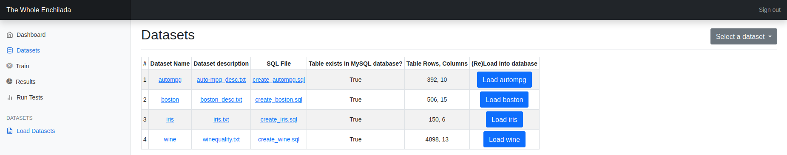
</p>

The user can load four toy datasets - AutoMPG, Boston, Iris, and Wine - into the MySQL database by pressing the corresponding load button.  The load button executes code that reads a .SQL file and executes its commands to insert the dataset as a table in the `ml_data` database.  The user can also click on the hyperlinks in the table to view the descriptions of the datasets or view the datasets themselves.  The text files containing the descriptions and data are embedded into the page using an iFrame.

#### Exploratory Data Analysis (EDA)
Once the user has loaded at least one dataset into the MySQL database and selected it from the dropdown menu, the `Flask` webserver queries the MySQL database for the data of interest, and then `pickle`s the data and some metadata to a shared Docker volume that can be accessed by the container running the `Bokeh` server.  Navigating to the Datasets page will then load a `Bokeh` visualization for exploratory data analysis that is comprised of four tabs: the summary tab, the feature importance tab, the crossfilter tab, and the grid plot tab.

##### Summary Tab

<p align="center">
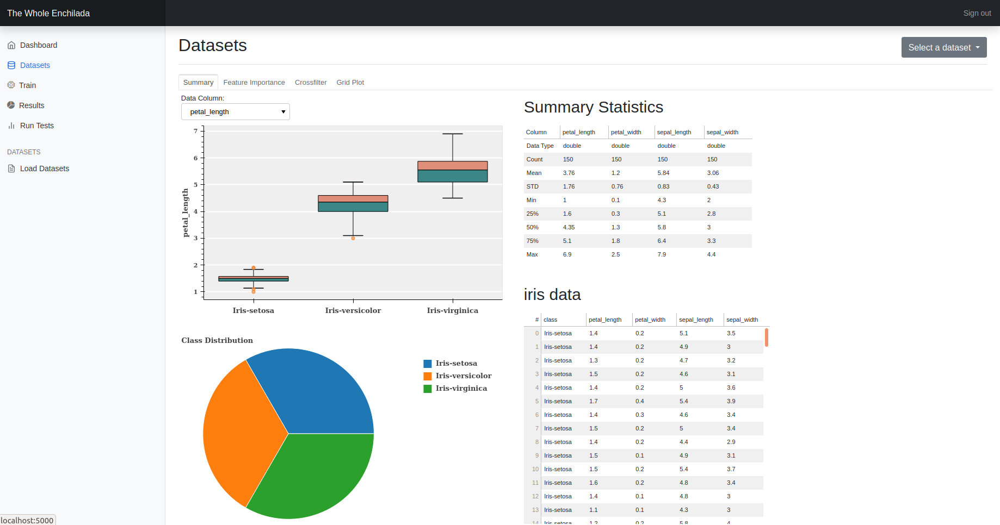
</p>

For classification problems, the EDA visualization presents a pie chart of the class distribution of the data and an interactive box plot of the distribution of a feature by class.  The box plot has a dropdown menu widget that allows the user to select which feature they'd like to plot.  These plots are not built-in to `Bokeh` but are instead based on examples from the [Bokeh gallery.](https://docs.bokeh.org/en/latest/docs/gallery.html)

The visualization also presents two data tables: a table containing summary statistics about the data and a table containing the actual data in the dataset.  The summary statistics are based on `panda`'s [describe() method](https://pandas.pydata.org/pandas-docs/stable/reference/api/pandas.DataFrame.describe.html), but I actually calculated all of the statistics using SQL queries.  The regression version of this page does not have the pie chart, and the box plot has all of the features plotted simultaneously.

##### Feature Importance Tab

<p align="center">
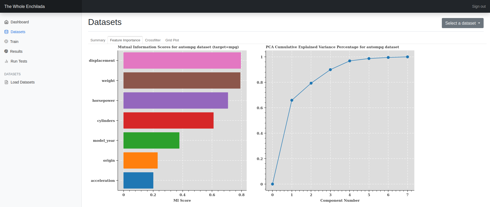
</p>

The feature importance tab uses `scikit-learn`'s [mutual information](https://scikit-learn.org/stable/modules/generated/sklearn.feature_selection.mutual_info_classif.html#sklearn.feature_selection.mutual_info_classif) and [principal component analysis](https://scikit-learn.org/stable/modules/generated/sklearn.decomposition.PCA.html#sklearn.decomposition.PCA) algorithms to analyze the amount of information contained in the features of the dataset.  The mutual information is presented as a horizontal bar graph arranged in order of mutual information score with the highest scoring feature at the top.  The PCA is presented as a line graph of the cumulative explained variance versus number of principal components.  This page is the same for both regression and classification tasks.

##### Crossfilter Tab

<p align="center">
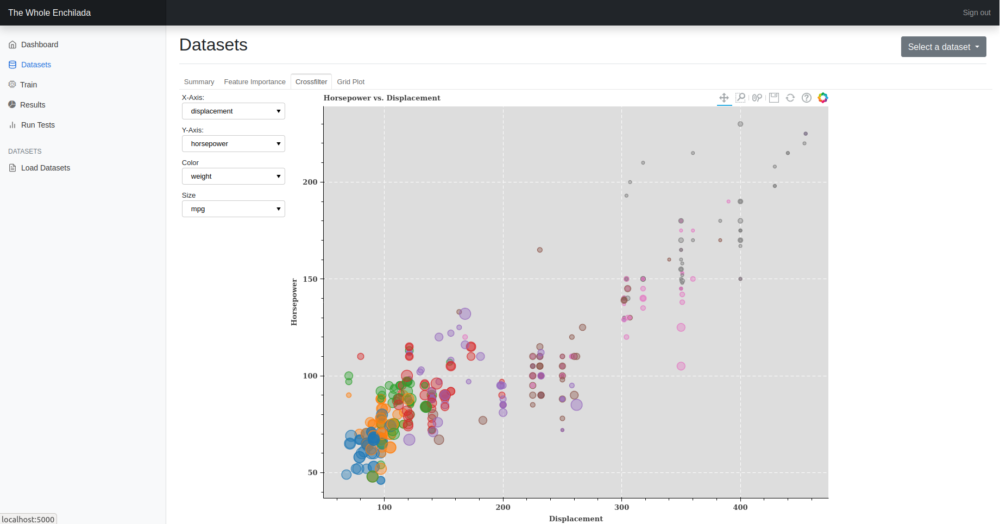
</p>

The crossfilter tab is based on [an example](https://demo.bokeh.org/crossfilter) from the `Bokeh` gallery.  It's an interactive plot with dropdown menus that allow the user to select the features used to generate the X-axis, Y-axis, marker sizes, and marker colors.  The classification version of the crossfilter plot does not have the color dropdown menu as the markers are colored according to class.

##### Grid Plot Tab

<p align="center">
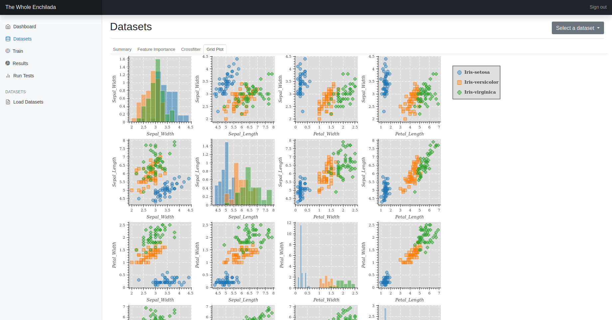
</p>

The inspiration for the grid plot tab is [Seaborn's PairGrid](http://seaborn.pydata.org/generated/seaborn.PairGrid.html#seaborn.PairGrid) plot.  The four most important features (as determined by mutual information score) are plotted against each other.  The diagonal plots where the X and Y axes are the same feature are plotted as histograms of that feature.  The classification version of this plot (shown above with the Iris dataset) plots a histogram for each class and color-codes the markers and histograms according to class.  The regression plot uses a single color and plots a single histogram in each diagonal plot.

### Train

<p align="center">
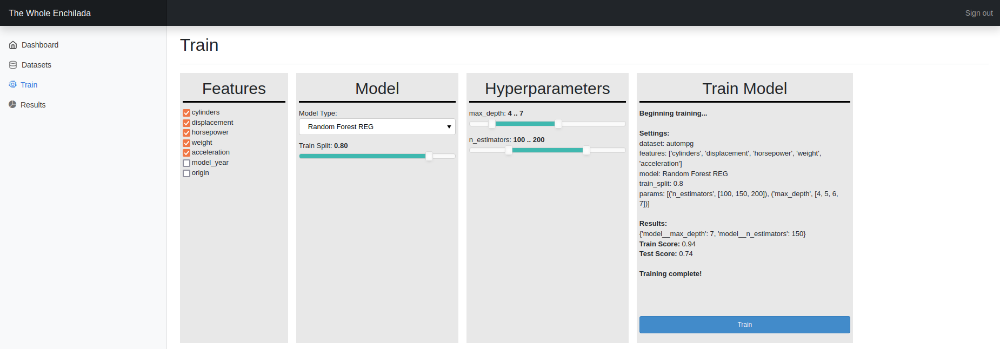
</p>

After selecting and exploring the dataset, the user next moves on to training a machine learning model on the data using `scikit-learn`.  The train page contains a simple `Bokeh` visualization with several widgets that allow the user to select which features to train on, select a type of model to train, tune the selected model's hyperparameters, and train the model and view a brief summary of the results.

The training is actually performed by the `Bokeh` server through callbacks attached to the train visualization.  The training settings selected by the user are stored in a dictionary and passed to a function that imports and runs the `scikit-learn` modules.  The function splits the dataset into a train and test set, creates a pipeline with `StandardScaler` and the user-selected model, creates a parameter grid of hyperparameter values, and feeds the pipeline and parameter grid into [GridSearchCV](https://scikit-learn.org/stable/modules/generated/sklearn.model_selection.GridSearchCV.html#sklearn.model_selection.GridSearchCV).  `GridSearchCV` determines the best combination of hyperparameters for the model using cross-validation.

The training data, the test data, the training settings, and the trained model are saved to the shared Docker volume using `joblib` [as recommended by](https://scikit-learn.org/stable/modules/model_persistence.html) the `scikit-learn` documentation.


### Results
The results page presents a detailed report of the model's performance.  This page differs significantly between the classification and regression tasks.

<p align="center">
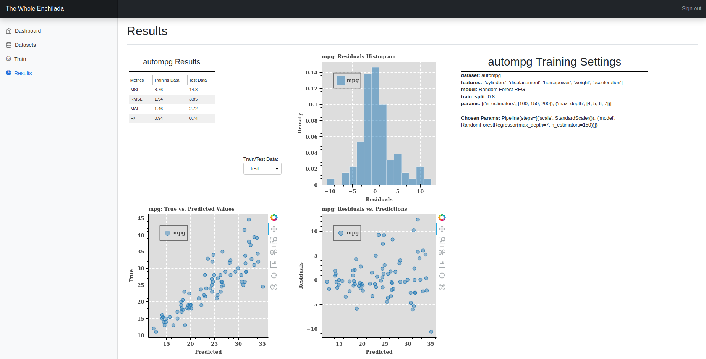
</p>

For regression tasks, the model's performance on the training and test data is summarized in a table using four different metrics: MSE, RMSE, MAE, and $R^2$.  There are three plots with a dropdown menu that toggles the plots between displaying test data and training data.  The training settings are summarized in the top-right.

The top-right plot is a histogram of the residuals.  This plot is useful to determine if the residuals are approximately Gaussian in nature, or if they are skewed left or right.  The bottom-right plots residuals versus predictions, which is useful to detect [heteroscedasticity](https://en.wikipedia.org/wiki/Heteroscedasticity).  The bottom-left plots the ground truth versus the values predicted by the model, which gives a visual indication of the model's performance.  A good model results in all of the markers tightly clustered along a 45 degree line.

<p align="center">
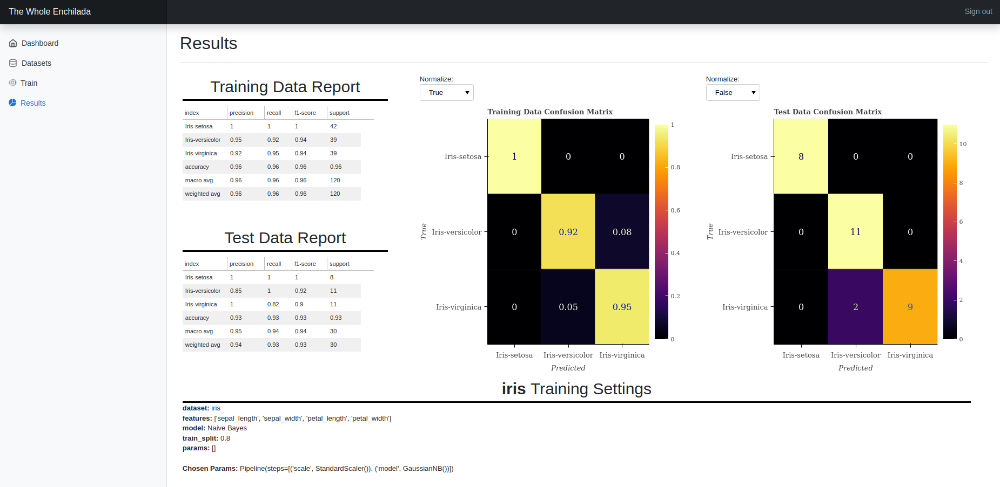
</p>

For classification tasks, the model's performance on the training and test data is summarized using `scikit-learn`'s [classification report](https://scikit-learn.org/stable/modules/generated/sklearn.metrics.classification_report.html?highlight=classification%20report#sklearn.metrics.classification_report), which includes metrics such as precision, recall, F1 score, and accuracy.  This report is summarized in a table for both the training data and the test data.  The training settings are summarized at the bottom of the page.

In addition, [confusion matrices](https://scikit-learn.org/stable/modules/generated/sklearn.metrics.confusion_matrix.html?highlight=confusion%20matrix#sklearn.metrics.confusion_matrix) are generated for both the training and test set using `scikit-learn` and are plotted using `Bokeh`.  Each confusion matrix has a dropdown menu that allows the user to toggle between a normalized and un-normalized confusion matrix.


### Running tests in development mode
In development mode the user can run unit tests, integration tests, and get code coverage reports from inside the web app itself.  A "Run Tests" link is added to the sidebar in development mode (right half of below image) that is otherwise hidden in production mode (left side of below image).

<p align="center">
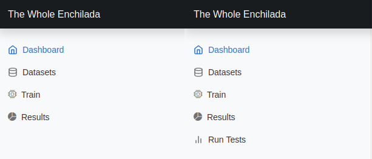
</p>

This allows the developer to make changes to the web app (or other code) and conveniently run and view test reports within the app itself.  The "Run Tests" page contains a table showing the date and times the tests were last run, and buttons that can be clicked to run the tests again.  In order to do this, `pytest` must be [run in a separate process](https://github.com/pytest-dev/pytest/issues/3143) or else the results of the test will be cached and the test reports will never change.  Once generated, the test reports can be viewed by clicking the links in the sidebar.

<p align="center">
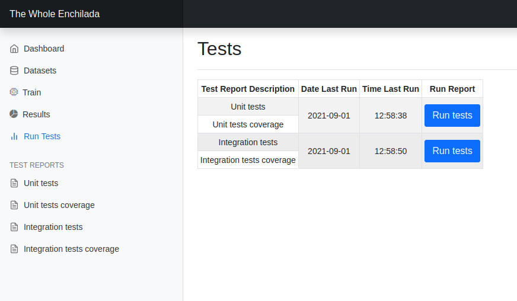
</p>

#### Embedding the test reports

<p align="center">
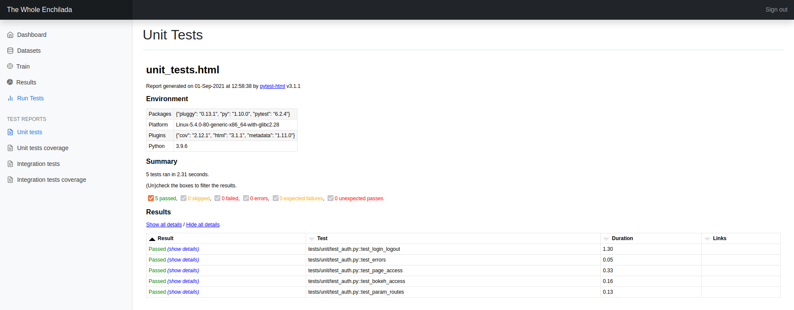
</p>

<p align="center">
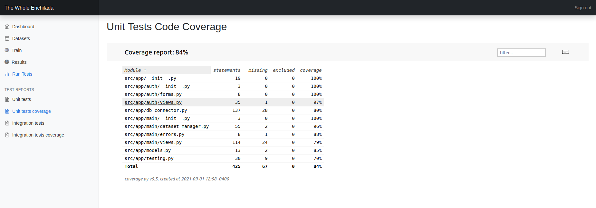
</p>

The test reports are generated using `pytest-cov` and `pytest-html` for coverage reports and `pytest` reports, respectively.  These test reports are generated as HTML documents with code highlighting, filters, and other attractive features.  I embedded these HTML documents into my Jinja templates using an iFrame.  This almost worked perfectly - except that the iFrame does not scale its height to the height of the embedded document.  Instead, the height of the iFrame must be hard-coded to a value that may be too small or too large.  In either case, an unnecessary vertical scrollbar was created.  I looked for a solution to automatically size the iFrame's height to match the height of the embedded page, but like many things in web design there wasn't a single straightforward solution.  After trying several solutions that didn't work, [this solution](https://stackoverflow.com/a/53286303) finally worked for me.  I also used a slightly modified version of this solution to embed text files in the "Load Datasets" section of the web app.


## MySQL
Relational databases are ubiquitous, and the Structured Query Language (SQL) is the most popular language for interfacing with these types of databases.  Most people working in the field of data science or machine learning need to be proficient at basic SQL queries.  One of the goals of this project was to learn how to write SQL queries and how to access an SQL database using Python.  I chose to use version 8 of [Oracle's MySQL database](https://www.mysql.com/products/community/) for this purpose.  MySQL is open source, and Oracle provides both a Docker image of a MySQL server as well as a Python package called [MySQL Connector/Python](https://dev.mysql.com/doc/connector-python/en/) to access the database via Python code.  In addition to Oracle's excellent online documentation, I also referred to [Murach's MySQL](#references-and-acknowledgments) and solved all of the programming exercises in the first several chapters.  I used my solutions to these exercises as integration tests to verify that the container running the `Flask` web server could access MySQL databases in the container running the MySQL server.

### TWE's use of the MySQL server
TWE allows the user to select from four "toy" datasets commonly used for pedagogical purposes. Of course, these tiny datasets don't need to be stored in a relational database - they're small enough to be directly read from a text file.  One of the functions of the `Flask` web app is to query data from the MySQL server and use it to train a `scikit-learn` machine learning model, and for this purpose the toy datasets work just fine.  I created a database called `ml_data` on the MySQL server by passing an environment variable in the Docker Compose YAML file.  The web app user can load tables into this database by navigating to the appropriate page and selecting the toy dataset of interest.  The MySQL Connector/Python then reads in the corresponding .SQL file and executes its commands to insert the table into the database.

In addition to passing the `ml_data` database name in the Docker Compose YAML, I also pass the user account "flask" that will be granted superuser access to the `ml_data` database.  The "flask" user must be logged into the MySQL server to add or query tables.  The MySQL server thus serves a second purpose by providing user authentication for the web app in concert with the `Flask-Login` package.  The user logs into the web app using his MySQL "flask" username and password, and `Flask-Login` queries the MySQL server every time the user visits a route protected with the `@login_required` decorator.  The query itself is simple - it queries the [USER()](https://dev.mysql.com/doc/refman/8.0/en/information-functions.html#function_user) function and checks to see that the username returned by the MySQL server matches the user logged into the web app.  The username check itself isn't particularly important; it's mostly checking that the user is logged into the MySQL database as the query can't be made without an active connection.  The web app redirects the user to the login page if the query fails.

### MySQL Default Authentication Method
As of MySQL 8.0, the default authentication method is `caching_sha2_password`.  The example Docker Compose YAML shown on the [Docker MySQL server image on Docker Hub](https://hub.docker.com/_/mysql/) still lists `mysql_native_password`.  This should be changed to `caching_sha2_password` in the YAML file for MySQL 8.0, and specified as the `auth_plugin` option when connecting to the server using MySQL Connector/Python.


## Bokeh
`Bokeh` is a Python data visualization library that links with `BokehJS`, a JavaScript client library that actually renders the visuals in a web browser.  `Bokeh` allows you to create interactive plots and widgets in Python that can be deployed in web apps or Jupyter notebooks, while handling all of the JavaScript behind the scenes.  Their documentation states _**“We write the JavaScript, so you don’t have to."**_

`Bokeh` will generate all of the HTML and JavaScript necessary to create beautiful interactive plots with dropdown menus, tabs, slider bars, radio buttons, and other types of widgets.  However, there is a catch: callback functions are required to make the widgets interactive.  The standalone HTML file generated by `Bokeh` will work fine for simple plots that only require zooming and panning, but if widgets are desired a `Bokeh` server must be run to set up event handlers.  As stated in the documentation:

> The primary purpose of the Bokeh server is to synchronize data between the underlying Python environment and the BokehJS library running in the browser.

The only other option is to write [JavaScript callbacks](https://docs.bokeh.org/en/latest/docs/user_guide/interaction/callbacks.html#userguide-interaction-jscallbacks) that can be embedded in the page along with the visualization itself.  Seeing as that would violate the spirit of `Bokeh` (and because I don't want write JavaScript) I chose to run a `Bokeh` server in a separate Docker container to serve my plots.

### Setting up a Bokeh server
Setting up the `Bokeh` server ended up being trickier than I had imagined.  The `Bokeh` server must be accessible to both the `Flask` webserver residing inside the Docker network, and to the client (browser) viewing the `Bokeh` visualizations outside of the Docker network.  Per the documentation:

> To reduce the risk of cross-site misuse, the Bokeh server will only initiate WebSocket connections from the origins that are explicitly allowed. Requests with Origin headers that are not on the allowed list will generate HTTP 403 error responses.

And so in the `Bokeh` Dockerfile I added `ENV BOKEH_ALLOW_WS_ORIGIN=localhost:5000,localhost:5006` to allow access to requests originating from the `Flask` webserver and the user's browser, respectively.  But there's another gotcha: within the Docker network, `Flask` connects to the `Bokeh` server at `http://bokeh:5006/`.  However, the client (browser) will connect to the `Bokeh` server at `http://localhost:5006/`.  This causes a problem, because the script embedded into the Jinja template will contain an invalid URL!  To fix this, I simply use the Python `replace()` function to swap out the URLs in the script before rendering it in the Jinja template.  This allows me to successfully serve a `Bokeh` visualization (with callbacks) from my `Flask` webserver.

### Securing access to the Bokeh server
However, this means that an unauthenticated user could gain access to the `Bokeh` visualizations just by navigating to `http://localhost:5006/` in their browser.  The `Bokeh` documentation discusses using [signed session IDs](https://docs.bokeh.org/en/latest/docs/user_guide/server.html?highlight=session_id%20options#signed-session-ids) to embed a `Bokeh` application inside a `Flask` web app in such a way that *only* requests authorized by the web app are accepted by the `Bokeh` server.  [This Stackoverflow post](https://stackoverflow.com/questions/43183531/simple-username-password-protection-of-a-bokeh-server) goes into greater detail on how to go about implementing this feature.  A secret key must be supplied to the `Bokeh` server and the `Flask` web app.  A secure secret key can be conveniently generated for your use by typing `bokeh secret` into the terminal after installing `Bokeh`.  I passed the secret key to both containers using Docker secrets and set the `Bokeh` container's `BOKEH_SIGN_SESSIONS` environment variable to `yes` (documentation sometimes says to use `True`).  I set the `ENTRYPOINT` of the `Bokeh` Dockerfile to run a bash script to set the secret key as an environment variable.  I built the images, spun up the containers, and navigated my browser to the appropriate web app route - but it didn't work!

Even after hours of fiddling with the code I continued to receive an error claiming that I had an invalid token signature when I attempted to serve a visualization through `Flask`.  After a great deal of frustrated web searching, I came across [this post](https://discourse.bokeh.org/t/flask-bokeh-externally-signed-sessions-invalid-token-signature-error/7059/4) that pointed out an omission in the documentation: the `BOKEH_SIGN_SESSIONS=yes` environment variable must also be set in the container running `Flask`!  If it's not, the session ID generated using `generate_session_id()` will not be signed, even if the `signed=True` argument is set in the function call!  Once I set this environment variable I was finally able to securely&dagger; serve `Bokeh` visualizations through my web app with support for callbacks.

&dagger; *Not as securely as I would like, as the secret key must be contained in an environment variable as plain text.  Unfortunately, until the above bug is fixed there does not appear to be any other way to make the signed session ID approach work.*

### Checking if the Bokeh plot has rendered
Large `Bokeh` visualizations take a few seconds to load, and so I added a Bootstrap spinner to my Jinja template to give a visual indication to the user that something is happening.  However, hiding the spinner once the visualization rendered again proved trickier than I expected.  I assumed that I could write a JavaScript function that is called on a `document.onreadystatechange` event to hide the spinner once the visualization renders, but that approach didn't work.  The document is considered to be completely loaded (`document.readyState === "complete"`) before the visualization is rendered, and so the spinner never appears on the page.  After some experimentation, I found that I could wrap the injected `Bokeh` JavaScript code in a `<div>` and use `ResizeObserver` to check if the height of the `<div>` was greater than zero.  If so, the visualization has rendered and the spinner can be hidden.

### Limitations of the Bokeh server
It's possible to serve multiple apps by listing each app's file or directory in the command:

```bash
bokeh serve src/bokeh_server/eda src/bokeh_server/train src/bokeh_server/results --address 0.0.0.0 --session-ids external-signed
```
This will serve the all three of the TWE visualizations and is the ENTRYPOINT command I use in production mode.  However, `Bokeh`'s development mode will only work with one app at a time.  And so to serve the exploratory data analysis visualization (for instance) in development mode, I use the following commmand:

```bash
bokeh serve src/bokeh_server/eda --dev --address 0.0.0.0 --session-ids external-signed
```

Putting the `Bokeh` server in development mode is essential during the final tweaking of the visualization, because otherwise the `Bokeh` server must be stopped and restarted for changes to take effect.  `src/bokeh_server/boot.sh` can be edited to change which app is served by `Bokeh` in development mode.

### Bokeh versus Seaborn
[Seaborn](http://seaborn.pydata.org/) is probably the most popular Python visualization tool for data science (excluding `matplotlib`, of course).  Based on PyPi's [monthly download](https://hugovk.github.io/top-pypi-packages/top-pypi-packages-30-days.json) count, `Seaborn` gets about 6x more downloads than `Bokeh`.  So how does `Bokeh` stack up to the more popular `Seaborn`?  Having used both tools, `Bokeh`'s obvious advantage is that it can produce interactive plots that run natively in a web browser.  `Seaborn` produces beautiful plots, but they aren't interactive and need to be imported into the browser as image files.

`Bokeh`'s major disadvantage is that it doesn't have the wide variety of built-in plots that `Seaborn` has.  You can produce any kind of plot that you'd like in `Bokeh`, but if it's anything more complicated than a scatter plot or a bar graph you will have to create all of the plot primitives yourself.  The box plot and pie chart visualizations that I included in TWE are great examples of this.  I was only able to produce these plots because there was example code available in the `Bokeh` GitHub repo.  Even so, modifying the example code to fit my needs was tedious - all `Seaborn` requires is to put your data in a `pandas` dataframe and then call the `boxplot()` method!  That being said, the developers of `Bokeh` have obviously put an enormous amount of work into the tool (and its documentation), and so `Seaborn`'s advantage here may dwindle over time.


## References and Acknowledgments

1. J. Murach, Murach’s MySQL, 3rd edition. Fresno, CA: Mike Murach & Associates, Inc, 2019.
2. M. Grinberg, Flask web development: developing web applications with Python, 2nd edition. Sebastopol, California: O’Reilly, 2018.
3. J. Turnbull, The Docker Book. S.l.: s.n., 2014.
4. “MySQL :: MySQL Connector/Python Developer Guide.” https://dev.mysql.com/doc/connector-python/en/ (accessed Sep. 03, 2021).
5. “StatLib---Datasets Archive.” http://lib.stat.cmu.edu/datasets/ (accessed Sep. 03, 2021).
6. “UCI Machine Learning Repository.” https://archive.ics.uci.edu/ml/index.php (accessed Sep. 03, 2021).
7. “Ryan Holbrook | Staff.” https://www.kaggle.com/ryanholbrook/home (accessed Sep. 03, 2021).


Enchilada icon made by "Icongeek26" from [https://www.flaticon.com/](https://www.flaticon.com/)


## Appendix A: Useful Commands
A collection of commands that I found useful during the development of TWE.

### General Docker commands
- Show all existing containers, running or stopped:
`docker ps -a`

- Show all environment variables in a container
 `docker exec <container> env`

- Show container's secret files
`docker container exec $(docker ps --filter name=<container> -q) ls -l /run/secrets`

- View secret
`docker container exec $(docker ps --filter name=<container> -q) cat /run/secrets/<secret>`

- Create terminal access to container
`docker exec -it <container> bash`

- Copy file from container to local disk
`docker cp <container>:<container path> <local path>`

- Check docker container's timezone
`docker exec -it <container> cat /etc/timezone`


### Docker commands for MySQL container

- Create bash terminal
`docker exec -it <MySQL container> bash`

- Login to MySQL server as root (enter root password at prompt)
`mysql -uroot -p`

- Dump entire database to a file
`mysqldump -uroot -p --all-databases > dump.sql`

- Load dump into mysql database
`mysql -uroot -p < dump.sql`

- Run .sql file from inside MySQL prompt (logged in as root):
`source mysql/create_databases.sql`
